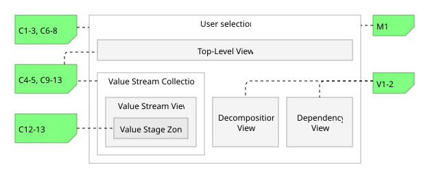
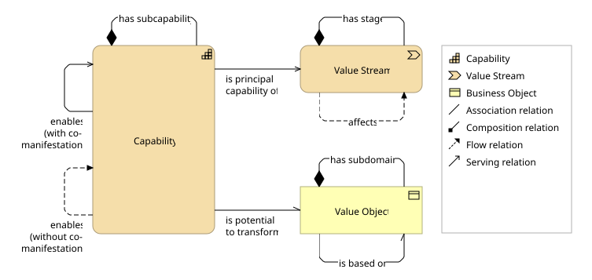
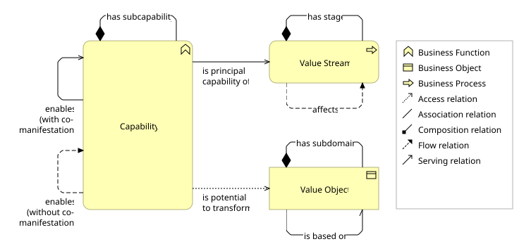

# COVO Validator for Archi

The COVO Validator is a jArchi script designed to validate ArchiMate models against the [Capability-Object-Value Ontology (COVO)](https://ceur-ws.org/Vol-4171/paper_41.pdf) to establish clear capability boundaries.

The script implements [COVO's constraints](https://github.com/sefanja/COVO/blob/main/v2/constraints.md) (C1-13), a metamodel check (M1) and two view completeness checks (V1-2).

## Key Features

1. **Progressive validation workflow**. The tool supports the architect's natural workflow by offering two validation profiles:
   * **Construction mode**: validation for work-in-progress.
   * **Audit mode**: strict validation for release candidates.

2. **Heuristic view classification**. The tool analyzes the content of your views to automatically apply the correct validation logic:
   * **Top-Level Views**: containing only top-level elements.
   * **Value Stream Views**: where all the stages belong to the same top-level value stream.
     * **Value Stream Collections**: group of value stream views that share a common top-level value stream.
     * **Value Stage Zones**: all elements on a value stream view that overlap horizontally with a lowest-level value stream stage.
   * **Decomposition Views**: having at least one composition relationship.
   * **Dependency Views**: all other views are assumed to provide complete overviews of one or more element and relationship types at a certain decomposition level.

   

3. **Enterprise-grade performance**. Validates complex models (~1000 elements, ~100 views) in < 10 seconds.

## Prerequisites

[Archi](https://www.archimatetool.com/) with the jArchi plugin installed.

## Installation

1. Open **Archi**
2. Go to `Scripts → Scripts Manager`, and click **New Archi Script**
3. Name the new script `COVO Validator`
4. Click `Edit` if the script editor does not automatically open
5. [**Click here to open the script code**](https://raw.githubusercontent.com/sefanja/COVO-Validator/refs/heads/main/dist/COVO%20Validator.ajs)
6. Select all the text (`Ctrl+A`) and copy it (`Ctrl+C`)
7. In the the script editor, select all text (`Ctrl+A`) and overwrite it with the previously copied text (`Ctrl+V`).
8. **Save** the script (click the disk icon or press `Ctrl+S`)

## Usage

**New to COVO?** We recommend starting with the `example.archimate` model included in this repository. It contains a valid reference structure to test the validator.

1. **Open model**: Load your ArchiMate model (or [example.archimate](https://github.com/sefanja/COVO-Validator/blob/main/example.archimate)) in Archi.
2. **Select scope**: In the Model Tree, select the views, folders, or the entire model you wish to validate.
3. **Run**: Right-click the selection -> `Scripts` -> `COVO Validator`.
4. **Choose profile**: Select *Construction* or *Audit* from the dialog.
5. **Analyze**: Open the Script Console in Archi to view the report.

### The Console Report

```Text
######################################################################
                        COVO VALIDATION REPORT
######################################################################

OVERALL STATUS: FAILED

SELECTION:
 - AUDIT mode
 - 6 views
 - 16 elements
 - 18 horizontal relationships
 - 12 vertical relationships

VIOLATION SUMMARY:
 - C12: 1 violation


======================================================================
 VIEW: L1 VALUE STREAM V (1 violation)
 Type: Value Stream View
 Path: Views / Level 1
======================================================================
 [!!] C12 - Missing corresponding object relationship:
 - 'Capability C.4' (L1 Capability) --> 'Capability C.2' (L1 Capability)


Validation completed in 264 ms
```

## Metamodel

To ensure that the COVO Validator interprets your model correctly, use one of the following metamodels. Your chosen metamodel will be detected automatically.

### Strategy Layer

ArchiMate does not have a passive structure element in its Strategy Layer to model COVO's _value object_. We therefore cross over into its Business Layer to use the Business Object. In this metamodel, the Business Object is intended to be at the same abstraction and strategic level als the Capability.



For a better modeling experience in Archi when visually nesting an object inside a capability:

1. Click on **Edit**, **Preferences**.
2. Navigate to **Connections**, **ARM**.
3. In **Relation types offered when creating new relations**, select: **Association relation**.
4. Click **Apply and Close**.

### Business Layer

To support alternative metamodel choices, the COVO Validator also supports modeling in the Business Layer.



## Reference & Examples

To see the COVO method applied in a large-scale, real-world environment within the Dutch energy sector, explore the [**NBility Model**](https://nbility.netbeheernederland.nl/model/). The upcoming version (2.4) extensively uses COVO principles in its 'core' domain. For a concrete example of a COVO-compliant structure, see:

* [**N2 Waardestroom C.A**](https://nbility.netbeheernederland.nl/review-2.4/?view=id-caad12a9fb99480c8037d509a0dbe0c2)

This repository also includes a local [example.archimate](https://github.com/sefanja/COVO-Validator/blob/main/example.archimate) file, which serves as a sandbox for testing the validator's constraints.

## Project Structure

* `main.js`: Entry point. Handles user interaction, scope collection, and report generation.
* `constraints.js`: Contains the logic for constraints C1-13 and V1-2.
* `utils.js`: A library for graph traversal, caching, and COVO model projection.
* `config.js`: Configuration and auto-detection logic.
* `example.archimate`: A small and valid COVO example model.

## Citation

If you use this tool or the COVO method in your research, please cite the foundational paper. You can use the **"Cite this repository"** button in the GitHub sidebar to export the citation in BibTeX or APA format.

## License

This project is licensed under the MIT License - see the LICENSE file for details.
