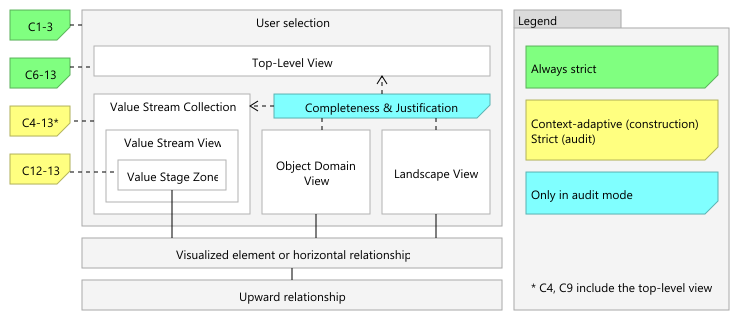

# COVO Validator for Archi

## Automating Semantic Symmetry in Business Architecture Modeling

The COVO Validator is a jArchi script designed to validate ArchiMate models against the [Capability-Object-Value Ontology (COVO)](https://ceur-ws.org/Vol-4171/paper_41.pdf). Building upon the original ontology, this tool implements a refined set of formal constraints (C1-13, V1-2) to establish semantic symmetry between organizational behavior (value streams and capabilities) and structure (objects).

## Key Features

1. **Progressive validation workflow**. The tool supports the architect's natural workflow by offering two validation profiles:
   * **Construction mode**: context-aware validation for work-in-progress.
   * **Audit mode**: strict validation for release candidates.

2. **Heuristic view classification**. The tool analyzes the structural content of your views to automatically apply the correct validation logic:
   * **Top-Level Views**: containing only top-level elements.
   * **Value Stream Views**: where all the stages belong to the same top-level value stream.
     * **Value Stream Collections**: group of value stream views that share a common top-level value stream.
     * **Value Stage Zones**: all elements on a value stream view that overlap horizontally with a lowest-level value stream stage.
   * **Object Domain Views**: consisting of a two-level structure with exactly one higher-level object and at least one relationship between objects.
   * **Landscape Views**: all other views are assumed to provide complete overviews of one or more element types at a certain refinement level.

   

3. **Dialect-agnostic (zero-config)**. Whether you use the Strategy Layer (Value Stream / Capability / Resource), the Business Layer (Business Process / Business Function / Business Object), or a mix, the tool automatically detects your modeling dialect and adjusts its internal logic accordingly.

4. **Enterprise-grade performance**. Validates complex models (~1000 elements, ~100 views) in < 15 seconds.

## Prerequisites

[Archi](https://www.archimatetool.com/) with the jArchi plugin installed.

## Installation

1. Open **Archi**
2. Go to `Scripts → Scripts Manager`, and click **New Archi Script**
3. Name the new script `COVO Validator`
4. Click `Edit` if the script editor does not automatically open
5. [**Click here to open the script code**](https://raw.githubusercontent.com/sefanja/COVO-Validator/refs/heads/main/dist/COVO%20Validator.ajs)
6. Select all the text (`Ctrl+A`), copy it (`Ctrl+C`), and **paste** it into the script editor
7. **Save** the script (click the disk icon or press `Ctrl+S`)

## Usage

**New to COVO?** We recommend starting with the `example.archimate` model included in this repository. It contains a valid reference structure to test the validator.

1. **Open model**: Load your ArchiMate model (or [example.archimate](https://github.com/sefanja/COVO-Validator/blob/main/example.archimate)) in Archi.
2. **Select scope**: In the Model Tree, select the views, folders, or the entire model you wish to validate.
3. **Run**: Right-click the selection -> `Scripts` -> `COVO Validator`.
4. **Choose profile**: Select *Construction* or *Audit* from the dialog.
5. **Analyze**: Open the Script Console in Archi to view the report.

### The Console Report

```Text
######################################################################
                        COVO VALIDATION REPORT
######################################################################

OVERALL STATUS: FAILED

SELECTION:
 - AUDIT mode
 - 6 views
 - 16 elements (Value Stream, Capability, Business Object)
 - 18 horizontal relationships
 - 12 vertical relationships (Composition Relationship)

VIOLATION SUMMARY:
 - C12: 1 violation


======================================================================
 VIEW: L1 VALUE STREAM V (1 violation)
 Type: Value Stream View
 Path: Views / Level 1
======================================================================
 [!!] C12 - Missing corresponding object relationship:
 - 'Capability C.4' (L1 Capability) --> 'Capability C.2' (L1 Capability)


Validation completed in 264 ms
```

## Modeling Guidelines

To ensure the COVO Validator correctly interprets your model, please follow these conventions:

* **Vertical hierarchy**: For refinement between levels (e.g., L0 to L1), use only **Composition** or **Aggregation**. The validator treats these as structural refinement; avoid using them for horizontal dependencies.
* **Co-manifestation**: To express that one capability is required concurrently by another (the *co-manifests for* relationship), use the **Serving** relationship. For standard *enablement* (where one capability creates a precondition for another, outside the scope of the current value stream stage), use any other relationship type (e.g., **Flow**).
* **Horizontal dependencies**: All other relationship types (Triggering, Association, Realization, etc.) are automatically recognized and validated according to the COVO logic.

## Reference & Examples

To see the COVO method applied in a large-scale, real-world environment within the Dutch energy sector, explore the [**NBility Model**](https://nbility.netbeheernederland.nl/model/). The upcoming version (2.4) extensively uses COVO principles in its 'core' domain. For a concrete example of a COVO-compliant structure, see:

* [**N2 Waardestroom C.A**](https://nbility.netbeheernederland.nl/review-2.4/?view=id-caad12a9fb99480c8037d509a0dbe0c2)

This repository also includes a local [example.archimate](https://github.com/sefanja/COVO-Validator/blob/main/example.archimate) file, which serves as a sandbox for testing the validator's constraints.

### Capability-to-Object Access (Optional)

By default, ArchiMate does not allow the *Access* relationship between a Capability and a Business Object. You have three options to model this semantic link:

1. **Business**: Substitute the strategy elements with **Business Process**, **Business Function**, and **Business Object**.
2. **Standard**: Use a **Directed Association** and visually nest the object inside the capability.
3. **Custom**: Enable the *Access* relationship in Archi by modifying the underlying model definitions. This allows for the most expressive COVO modeling experience:
   1. Close Archi.
   2. Locate `relationships.xml` in your Archi installation folder, typically under: `plugins/com.archimatetool.model_x.x.x/model/relationships.xml`.
   3. Find the section `<source concept="Capability">`.
   4. Find the line `<target concept="BusinessObject" relations="o"/>` and change `relations="o"` to `relations="ao"`.
   5. Restart Archi.

**Note:** This technical modification deviates from the official ArchiMate 3.2 specification. While it provides the best modeling experience within Archi, the resulting models may show errors when opened in standard Archi installations or when exported via the ArchiMate Exchange Format to other tools.

## Project Structure

* `main.js`: Entry point. Handles user interaction, scope collection, and report generation.
* `constraints.js`: Contains the logic for constraints C1-13 and V1-2.
* `utils.js`: A library for graph traversal, caching, and COVO model projection.
* `config.js`: Configuration and auto-detection logic.
* `example.archimate`: A small and valid COVO example model.

## Citation

If you use this tool or the COVO method in your research, please cite the foundational paper. You can use the **"Cite this repository"** button in the GitHub sidebar to export the citation in BibTeX or APA format.

## License

This project is licensed under the MIT License - see the LICENSE file for details.
